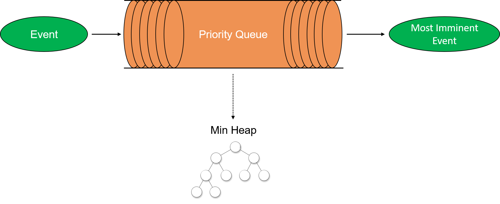
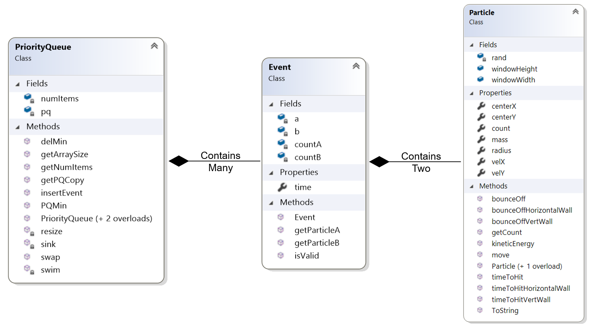

# Collision Simulation

This project is a simulation of the motion of particles in a closed 2D container. The simulation is event based rather than time-step based which increases accuracy and performance.

### How it works

* This simulation works by calculating the time to collision of each particle with respect to each other (and the walls). 

* Then it puts all of the calculated collision events into the priority queue which then sorts the events in descending order based on time to collision. 

* To move forewards in simulation time, the internal clock jumps to the next most imminent collision event and  calculates the new trajectories as well as times to collision for the particles involved.

The following is an illustration of the event-driven simulation architecture:

The following is the object oriented implementation of the underlying data structures that support the simulation:

---

### Accuracy
* Time-step method: If the time step is too large or if the speed of the particles is high, there is a high chance that the simulation will miss collisions since the particles will just "skip over" each other instead of colliding.

* Conversely, the event based method will not miss any collisions as it only steps the time stamp forwards to the nearest collision and re-sorts the priority queue.

### Efficiency

* If the number of particles is low, then using the time step method will result in the recomputation of particle position even when there are no collision events occuring, which wastes computional cycles. 

* Using the event based technique, the internal clock will just jump to the next most imminent collision rather than calculating the location of the particle when it is moving in a straight line.

* Take for example 2 particles in a large box. Collisions will be rare, yet the time-step method will repeatedly calculate the particles' locations. Conversely, the event-driven method will just jump to the next collision time. 

* This leads to different performance imrovements depending on the situation, however, the event-driven simulation will never perform worse than the time-step method.